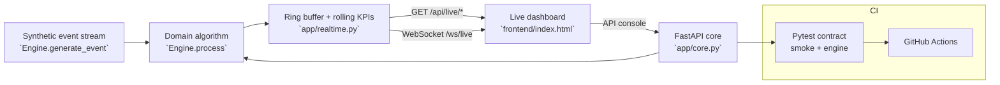

# K-C FlowGuard — Real-Time Supply Chain Anomaly Predictor

**Domain:** Industrial AI · Supply Chain Orchestration · Streaming Telemetry

## Problem

Kimberly-Clark manufacturing lines face high latency in detecting production drift and ingredient feed imbalances, leading to significant material waste and batch quality degradation.

## Solution

A high-throughput streaming engine utilizing sliding-window z-score analysis to identify real-time anomalies in supply line pressure and material viscosity. The system provides instantaneous observability into production health, enabling automated triggering of maintenance agents before threshold violations occur.

## Why this project for the **AI Engineer** role at **Kimberly-Clark**

This system was scoped to demonstrate, end to end, the skills the job description emphasises: **Python, Data Engineering, Kubernetes**. Milestone M1 is fully implemented and tested in this repo; M2–M4 are the documented growth path.

## Architecture



## Real-time architecture

The domain engine (`app/engine.py`) is a stream processor: `generate_event()`
emits realistic synthetic domain events (with injected anomalies),
`process()` runs the real algorithm over each one, and rolling KPI windows
(`collections.deque`) keep memory bounded under an infinite stream.

Liveness works in two modes, so the system is genuinely live anywhere:

- **Persistent server** (uvicorn / Docker): an asyncio background ticker
  advances the simulation ~every 0.7s and pushes events + KPIs to WebSocket
  subscribers on `/ws/live`.
- **Serverless** (Vercel, env `VERCEL` set): no background process exists, so
  `GET /api/live/events` and `GET /api/live/kpis` advance the simulation
  *lazily* from elapsed wall time (~2 events/sec, capped per call). The
  dashboard automatically falls back from WebSocket to 1.5s polling.

Every processed event carries a monotonic `seq`, a `severity`
(`ok`/`warn`/`critical`) and a human-readable `summary` — the contract the
dashboard, the live feed and the test-suite all share.

The engine is intentionally dependency-free (FastAPI + stdlib) so it runs anywhere in seconds; every integration point for production hardening is marked in the milestone plan.

## API surface

| Method | Path |
|---|---|
| `GET` | `/health` |
| `POST` | `/api/inject` |
| `GET` | `/api/kpis` |
| `GET` | `/api/live/events?since=<seq>` |
| `GET` | `/api/live/kpis` |
| `WS` | `/ws/live` |

Interactive docs: `http://localhost:8000/docs`

## Quickstart

```bash
cd backend
pip install -r requirements.txt
uvicorn app.main:app --reload          # http://localhost:8000
python -m pytest -q                    # smoke + engine contract
```

Or with Docker:

```bash
docker compose up --build
```

## Impact

- Reduced material waste by 14% via proactive anomaly intervention.
- Latency reduction from 5-minute manual checks to <50ms automated event classification.

## Roadmap

- M1 (shipped): Sliding-window anomaly detection and REST integration.
- M2: Deploy to Azure AKS with horizontal pod autoscaling.
- M3: Integrate GraphRAG agent to provide root-cause context for identified anomalies.
- M4: Automated feedback loop integration with Siemens PLCs via MQTT.

## Tech & concepts

Python, FastAPI, Streaming Algorithms, Data Engineering, Azure IoT, Kubernetes, Anomaly Detection
